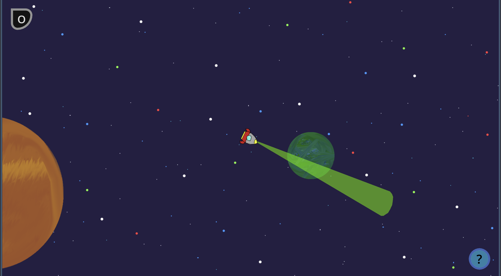
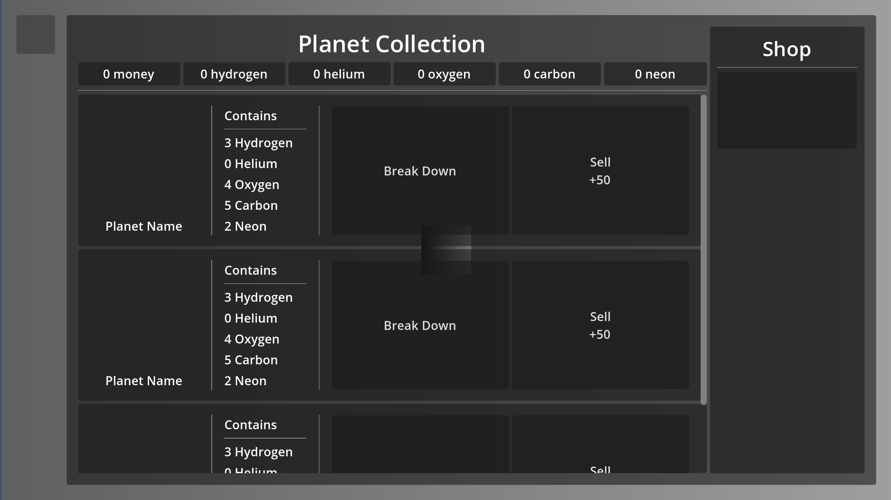
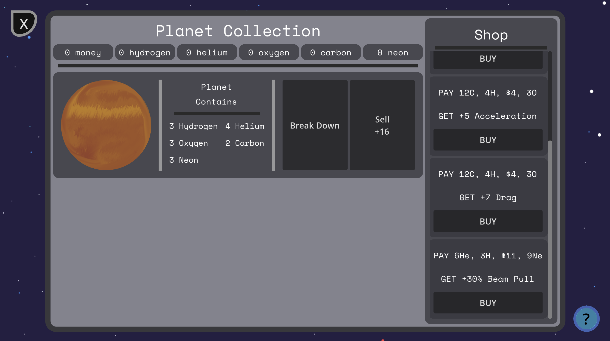

# Orb It
A survival game made for Hackclub's Siege Week 7.
The theme this week was Space.

---
## Controls
- (W / Up Arrow) -> Move forwards
- (S / Down Arrow) -> Brake
- (A / Left Arrow) -> Turn left
- (D / Right Arrow) -> Turn right.
- Play [here!](https://baton-0.itch.io/orb-it)
## Overview
- Back To Inheritance -> Used inheritance instead of composition for the first time in a few months for this project, to make sure I still remembered how to do it. I do, though it's still worse than comp. in my opinion.
- Art -> One of my few attempts at making non-pixel art art! It went decently, though there are some uncomfortable resolution things going on with the ship.
    - Art made in Krita
## Credits
- All assets, code etc made by me. No credits this week!
---
## Devlogs
### Monday -> Setup & The Player
- Made the project, imported wakatime.
- Set up the player; controls like a very floaty vehicle, where you press L/R to turn and F/B to go forwards and brake.
### Tuesday -> Basic Planets, UI
- Made planets that glide towards their home point (setup for a tractor beam)
- Made a menu to see and use your collected planets, where you'll be able to sell them for money or break them down into materials.
- 
### Wednesday -> Shop & Planet Randomizing
- Made the shop actually work, and made the planets randomize on spawn. Didn't do much today.
### Thursday
- Put in an absolute GRIND today to get this done early.
- Got ALL the art in.
- The shop finally has more than one upgrade, and a better upgrade system.
- 
- Made a node to randomly spawn planets around the player in a ring, spaced out from each other.
- Made a panel to show you how to play the game.
- 
- Lots and lots of bug fixes.
- Submission!